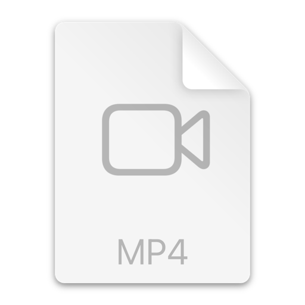

# Personal Notes App [MadNoteX]

A modern, cross-platform note-taking application built with **Compose Multiplatform**, running seamlessly on both Android and iOS.

## 📱 Features

- ✅ **Create Notes** - Add notes with custom titles, HTML content, and dates
- ✅ **List Notes** - View all your notes in a clean, modern interface
- ✅ **Delete Notes** - Remove notes with confirmation dialog
- ✅ **HTML Rendering** - Display rich HTML content in notes with interactive elements
- ✅ **Interactive HTML** - Click buttons and links in HTML content with dialog feedback
- ✅ **PDF Viewer** - View PDF documents from a URL
- ✅ **Local Database** - Persistent storage using SQLDelight
- ✅ **Material Design 3** - Modern, responsive UI with beautiful color palette

## 📁 Project Structure

The project follows a **modular architecture** with clear separation of concerns:

```
PersonalNotesApp/
├── composeApp/                    # Main application module
│   ├── src/
│   │   ├── androidMain/           # Android-specific resources & configs
│   │   ├── commonMain/            # Shared Kotlin code
│   │   └── iosMain/               # iOS-specific code
│   └── build.gradle.kts
│
├── iosApp/                        # iOS native app wrapper
│   ├── iosApp/                    # SwiftUI app entry point
│   │   ├── iOSApp.swift          # App initialization
│   │   ├── ContentView.swift     # Main UI wrapper
│   │   └── Info.plist            # iOS configuration
│   └── iosApp.xcodeproj/         # Xcode project
│
├── shared/                        # Shared modules (Clean Architecture)
│   ├── core-common/               # Common utilities & extensions
│   │   └── src/commonMain/
│   │
│   ├── core-database/             # Database layer (SQLDelight)
│   │   └── src/
│   │       ├── commonMain/
│   │       │   └── sqldelight/   # Database schema (.sq files)
│   │       ├── androidMain/       # Android database driver
│   │       └── iosMain/          # iOS database driver
│   │
│   ├── core-navigation/           # Navigation abstraction
│   │   └── src/commonMain/
│   │       └── navigation/       # Navigation contracts & router
│   │
│   ├── feature-notes/             # Notes feature module
│   │   └── src/
│   │       ├── commonMain/
│   │       │   └── com/personal/madNotex/feature/notes/
│   │       │       ├── data/      # Data layer
│   │       │       │   └── repository/
│   │       │       │       ├── NoteRepository.kt         # Repository interface
│   │       │       │       └── NoteRepositoryImpl.kt     # Repository implementation
│   │       │       │
│   │       │       ├── domain/    # Business logic layer
│   │       │       │   ├── model/
│   │       │       │   │   └── Note.kt                   # Domain model
│   │       │       │   └── useCases/
│   │       │       │       ├── DeleteNoteUseCase.kt
│   │       │       │       ├── GetNoteByIdUseCase.kt
│   │       │       │       ├── GetNotesUseCase.kt
│   │       │       │       └── SaveNoteUseCase.kt
│   │       │       │
│   │       │       ├── ui/        # Presentation layer
│   │       │       │   ├── addnote/
│   │       │       │   │   ├── AddNoteScreen.kt
│   │       │       │   │   └── AddNoteViewModel.kt
│   │       │       │   ├── notelist/
│   │       │       │   │   ├── NoteListScreen.kt
│   │       │       │   │   └── NoteListViewModel.kt
│   │       │       │   ├── notedetail/
│   │       │       │   │   ├── NoteDetailScreen.kt
│   │       │       │   │   └── NoteDetailViewModel.kt
│   │       │       │   ├── pdfviewer/
│   │       │       │   │   └── PdfViewerScreen.kt
│   │       │       │   ├── components/
│   │       │       │   │   ├── HtmlViewer.kt           # expect declaration
│   │       │       │       │   └── PdfViewer.kt        # expect declaration
│   │       │       │   ├── navigation/
│   │       │       │   │   └── RootNavigation.kt
│   │       │       │   └── theme/
│   │       │       │       ├── Color.kt
│   │       │       │       └── Theme.kt
│   │       │       │
│   │       │       └── di/
│   │       │           └── NotesModule.kt              # Koin DI module
│   │       │
│   │       ├── androidMain/       # Android platform-specific
│   │       │   └── ui/components/
│   │       │       ├── HtmlViewer.android.kt          # Android HTML viewer
│   │       │       └── PdfViewer.android.kt           # Android PDF viewer
│   │       │
│   │       └── iosMain/          # iOS platform-specific
│   │           └── ui/components/
│   │               ├── HtmlViewer.ios.kt              # iOS HTML viewer
│   │               └── PdfViewer.ios.kt               # iOS PDF viewer
│   │
│   └── localization/             # String resources
│       └── src/commonMain/
│           └── Strings.kt        # Centralized string definitions
│
├── gradle/
│   └── libs.versions.toml        # Version catalog for dependencies
│
├── build.gradle.kts              # Root build configuration
├── settings.gradle.kts           # Project settings & module inclusion
└── README.md                     # This file
```

### Key Principles

- **Modular Architecture**: Feature-based modules (`feature-notes`) for better separation
- **Clean Architecture**: Clear separation between Data, Domain, and UI layers
- **Platform-Specific Code**: Using `expect/actual` pattern for platform-specific implementations
- **Shared Business Logic**: All business logic and UI in `commonMain` for maximum code reuse

## 🏗️ Architecture Explanation

The app follows **MVVM (Model-View-ViewModel)** architecture combined with **Clean Architecture** principles:

### Architecture Layers

1. **Presentation Layer (UI)**
   - **Compose Multiplatform UI**: Shared UI components using Jetpack Compose
   - **ViewModels**: Handle UI state and business logic coordination
   - **Screens**: `NoteListScreen`, `AddNoteScreen`, `NoteDetailScreen`, `PdfViewerScreen`
   - **Components**: Reusable UI components like `HtmlViewer` and `PdfViewer`

2. **Domain Layer (Business Logic)**
   - **Use Cases**: Encapsulate single business operations
     - `GetNotesUseCase` - Fetch all notes
     - `GetNoteByIdUseCase` - Fetch single note
     - `SaveNoteUseCase` - Create/update note
     - `DeleteNoteUseCase` - Remove note
   - **Models**: Domain entities (`Note.kt`)
   - **Repository Interfaces**: Define data access contracts

3. **Data Layer**
   - **Repository Implementations**: Concrete implementations of repository interfaces
   - **Database**: SQLDelight for type-safe SQL queries
   - **Platform-Specific Drivers**: Android and iOS database drivers

### Current Architecture Flow

```
UI Screen (Compose)
    ↓
ViewModel (State Management)
    ↓
Use Case (Business Logic)
    ↓
Repository (Data Access)
    ↓
Database (SQLDelight)
```

### Dependency Injection

Using **Koin** for dependency injection:
- **Modules**: Feature-based DI modules (e.g., `NotesModule`)
- **Scoping**: Proper scoping for ViewModels and Repositories
- **Platform Support**: Works seamlessly across Android and iOS

### Multiplatform Pattern

- **Expect/Actual**: Platform-specific implementations
  - `HtmlViewer`: `expect` in common, `actual` for Android and iOS
  - `PdfViewer`: `expect` in common, `actual` for Android and iOS
  - Database drivers: Platform-specific implementations

- **Shared Code**: Maximum code reuse in `commonMain`
  - Business logic, UI, ViewModels all shared
  - Only platform-specific integrations in `androidMain` and `iosMain`

## 📚 List of Libraries Used

### Core Framework
- **Kotlin Multiplatform** `2.1.21` - Shared business logic across platforms
- **Compose Multiplatform** `1.8.0` - Shared UI framework
- **Material Design 3** - Modern UI components and design system

### Database
- **SQLDelight** `2.0.1` - Type-safe SQL database
  - `sqldelight-runtime` - Core runtime
  - `sqldelight-android` - Android driver
  - `sqldelight-native` - iOS native driver
  - `sqldelight-coroutines` - Coroutines extensions for reactive queries

### Dependency Injection
- **Koin** `4.0.3` - Lightweight dependency injection framework
  - `koin-core` - Core DI functionality
  - `koin-compose` - Compose integration
  - `koin-composeVM` - ViewModel integration
  - `koin-android` - Android-specific extensions

### Navigation
- **Navigation Compose** `2.8.0-alpha11` - Type-safe navigation framework
  - Navigation with serialization support
  - Deep linking support

### Async & Concurrency
- **Kotlinx Coroutines** `1.8.0` - Asynchronous programming
  - Coroutines for background operations
  - Flow for reactive data streams

### Serialization
- **Kotlinx Serialization** `1.6.3` - JSON serialization
  - `kotlinx-serialization-json` - JSON format support
  - Used for data serialization and navigation arguments

### Date & Time
- **Kotlinx DateTime** `0.6.0` - Date/time handling
  - Cross-platform date/time operations
  - Formatting and parsing

### Android Specific
- **Android Activity Compose** `1.10.1` - Activity integration
- **Android Core KTX** `1.16.0` - Kotlin extensions
- **Android AppCompat** `1.7.0` - Backward compatibility
- **Lifecycle ViewModel Compose** `2.8.4` - ViewModel lifecycle
- **Lifecycle Runtime Compose** `2.8.4` - Runtime compose support
- **Target SDK**: 35
- **Min SDK**: 29

### Build Tools
- **Android Gradle Plugin** `8.6.1` - Android build system
- **Gradle Version Catalog** - Centralized dependency management via `libs.versions.toml`

## 📝 How HTML Clicks Are Handled

The app implements a **JavaScript Bridge** pattern to enable bidirectional communication between HTML content rendered in WebView/WKWebView and native Kotlin code.

### Implementation Overview

The HTML content can trigger JavaScript functions that communicate with the native app through a bridge interface named `JavaScriptBridge`.

### Android Implementation

**File**: `shared/feature-notes/src/androidMain/kotlin/com/personal/madNotex/feature/notes/ui/components/HtmlViewer.android.kt`

```kotlin
AndroidView(
    factory = { context ->
        WebView(context).apply {
            settings.javaScriptEnabled = true
            settings.domStorageEnabled = true
            
            addJavascriptInterface(
                object {
                    @JavascriptInterface
                    fun postMessage(message: String) {
                        onMessageReceived(message)
                    }
                },
                "JavaScriptBridge"
            )
        }
    },
    update = { webView ->
        webView.loadDataWithBaseURL(null, html, "text/html", "UTF-8", null)
    }
)
```

**How it works:**
1. JavaScript is enabled on the WebView
2. A JavaScript interface is added with the name `JavaScriptBridge`
3. The `postMessage` function is exposed to JavaScript
4. When called from HTML, it triggers `onMessageReceived` callback in Kotlin

### iOS Implementation

**File**: `shared/feature-notes/src/iosMain/kotlin/com/personal/madNotex/feature/notes/ui/components/HtmlViewer.ios.kt`

```kotlin
UIKitView(
    factory = {
        val configuration = WKWebViewConfiguration()
        val messageHandler = object : NSObject(), WKScriptMessageHandlerProtocol {
            override fun userContentController(
                userContentController: WKUserContentController,
                didReceiveScriptMessage: WKScriptMessage
            ) {
                val message = didReceiveScriptMessage.body as? String
                message?.let { msg ->
                    scope.launch(Dispatchers.Main) {
                        onMessageReceived(msg)
                    }
                }
            }
        }
        
        configuration.userContentController.addScriptMessageHandler(
            messageHandler,
            "JavaScriptBridge"
        )
        
        WKWebView(frame = CGRectMake(0.0, 0.0, 0.0, 0.0), configuration = configuration)
    }
)
```

**How it works:**
1. WKWebViewConfiguration is created with a message handler
2. `WKScriptMessageHandlerProtocol` implementation receives messages
3. Messages are dispatched to the main thread for Compose state updates
4. The handler is registered with the name `JavaScriptBridge`

### HTML Content Pattern

HTML content must include a JavaScript function that calls the bridge:

```html
<button onclick="showInfo('Clicked on Button 1')">Click Me 1</button>
<a href="#" onclick="showInfo('Link Clicked')">Click This Link</a>

<script>
function showInfo(msg) {
    if (window.JavaScriptBridge) {
        window.JavaScriptBridge.postMessage(msg);
    }
}
</script>
```

### Flow Diagram

```
HTML Button Click
    ↓
JavaScript: showInfo('message')
    ↓
window.JavaScriptBridge.postMessage('message')
    ↓
Native Bridge Receives Message
    ↓
onMessageReceived('message') callback
    ↓
Compose State Update
    ↓
ModalBottomSheet displays message
```

### User Experience

When a button or link in HTML is clicked:
1. JavaScript function is executed
2. Message is sent via `JavaScriptBridge.postMessage()`
3. Native code receives the message
4. A **ModalBottomSheet** slides up from the bottom
5. The clicked message is displayed in a card-style UI
6. User can dismiss the sheet by tapping outside or the close button

## 📄 How PDF Viewing Is Handled

The app uses **Google Docs Viewer** to display PDF documents in a WebView/WKWebView across both platforms, ensuring consistent viewing experience.

### Implementation Overview

Both Android and iOS implementations use the same approach: loading PDFs through Google Docs Viewer service which provides an embedded viewer interface.

### Android Implementation

**File**: `shared/feature-notes/src/androidMain/kotlin/com/personal/madNotex/feature/notes/ui/components/PdfViewer.android.kt`

```kotlin
val viewerUrl = remember(url) {
    "https://docs.google.com/gview?embedded=true&url=$url"
}

AndroidView(
    factory = { context ->
        WebView(context).apply {
            settings.javaScriptEnabled = true
            settings.domStorageEnabled = true
            settings.loadWithOverviewMode = true
            settings.useWideViewPort = true
            settings.builtInZoomControls = true
            settings.displayZoomControls = false
            
            webViewClient = object : WebViewClient() {
                override fun onPageFinished(view: WebView?, url: String?) {
                    onLoadingStateChange(false)
                }
                override fun onPageStarted(view: WebView?, url: String?, favicon: Bitmap?) {
                    onLoadingStateChange(true)
                }
            }
        }
    },
    update = { webView ->
        if (webView.url != viewerUrl) {
            webView.loadUrl(viewerUrl)
        }
    }
)
```

**Features:**
- Uses Google Docs Viewer: `https://docs.google.com/gview?embedded=true&url={PDF_URL}`
- JavaScript enabled for viewer functionality
- Zoom controls enabled (built-in but not displayed)
- Loading state tracking via WebViewClient callbacks
- Wide viewport for better PDF display

### iOS Implementation

**File**: `shared/feature-notes/src/iosMain/kotlin/com/personal/madNotex/feature/notes/ui/components/PdfViewer.ios.kt`

```kotlin
val viewerUrl = remember(url) {
    "https://docs.google.com/gview?embedded=true&url=$url"
}

UIKitView(
    factory = {
        val configuration = WKWebViewConfiguration()
        configuration.allowsInlineMediaPlayback = true
        
        val webView = WKWebView(
            frame = CGRectMake(0.0, 0.0, 0.0, 0.0),
            configuration = configuration
        )
        
        val navigationDelegate = object : NSObject(), WKNavigationDelegateProtocol {
            override fun webView(webView: WKWebView, didFinishNavigation: WKNavigation?) {
                onLoadingStateChange(false)
            }
            override fun webView(webView: WKWebView, didStartProvisionalNavigation: WKNavigation?) {
                onLoadingStateChange(true)
            }
            override fun webView(webView: WKWebView, didFailNavigation: WKNavigation?, withError: NSError) {
                onLoadingStateChange(false)
            }
        }
        
        webView.navigationDelegate = navigationDelegate
        webView
    },
    update = { webView ->
        if (webView.url?.absoluteString != viewerUrl) {
            nsUrl?.let {
                val request = NSURLRequest.requestWithURL(it)
                webView.loadRequest(request)
            }
        }
    }
)
```

**Features:**
- Same Google Docs Viewer URL pattern
- WKWebView with proper configuration
- Navigation delegate for loading state tracking
- Error handling for failed navigations
- Native iOS PDF rendering capabilities

### Google Docs Viewer URL Format

```
https://docs.google.com/gview?embedded=true&url={PDF_URL}
```

**Parameters:**
- `embedded=true` - Embeds the viewer in an iframe-friendly format
- `url={PDF_URL}` - URL-encoded PDF document URL

**Advantages:**
- Works across both platforms consistently
- No need for native PDF libraries
- Automatic zoom and navigation controls
- Handles various PDF formats
- Requires internet connection

### Loading State Management

Both implementations track loading states:
- **Loading starts**: When PDF URL begins loading
- **Loading completes**: When PDF viewer finishes loading
- **Loading fails**: Error handling for network issues

The loading state is communicated to the UI via `onLoadingStateChange` callback, allowing the screen to show loading indicators.

### PDF Viewer Screen

The `PdfViewerScreen` composable:
- Displays the PDF viewer component
- Shows loading indicator during PDF load
- Handles error states
- Provides navigation back to previous screen

### Limitations & Considerations

- **Internet Required**: Google Docs Viewer requires active internet connection
- **URL Accessibility**: PDF URL must be publicly accessible
- **Privacy**: PDFs are processed through Google's service
- **Performance**: Large PDFs may take time to load
- **Offline**: No offline PDF viewing support

### Alternative Approaches (Future Considerations)

For offline support or better privacy:
- Use native PDF libraries (Android PDFView, iOS PDFKit)
- Download and cache PDFs locally
- Use platform-specific PDF renderers

## 🎬 Screen Recording of App Walk-through

### Android Walk-through


*Video file: `https://drive.google.com/file/d/1ONb7bPQCT6TjnDaL44VkxOjOqc41awu_/view?usp=drive_link`*

---

### iOS Walk-through


*Video file: `https://drive.google.com/file/d/1i7tsbjEU4tXSK2z8VzsYvTozLDK5iVP5/view?usp=drive_link`*

---

### App Flow

1. **Notes List** - View all notes, tap to view details, swipe to delete
2. **Add Note** - Create new note with title, HTML body, and date picker
3. **Note Detail** - View note with rendered HTML, interact with buttons/links
4. **PDF Viewer** - View PDF documents from URL

### User Interactions
- **Tap + Button** - Add new note
- **Tap Note Card** - View note details
- **Tap Delete Icon** - Confirm and delete note
- **Tap PDF Icon** - View sample PDF
- **Click HTML Button** - See toast and dialog

## 🚀 Getting Started

### Prerequisites

- **Android Studio** (latest version with KMP plugin)
- **Xcode** (latest version for iOS development)
- **Kotlin Multiplatform Mobile Plugin** - Installed via Android Studio
- **JDK 17+** - For Android builds
- **macOS** - Required for iOS development

### Running the Project

#### Android

1. Open project in Android Studio
2. Sync Gradle files (File → Sync Project with Gradle Files)
3. Select Android device or emulator
4. Click Run or press `Shift+F10`

#### iOS

**Option 1: Android Studio**
1. Open project in Android Studio
2. Select iOS device or simulator
3. Click Run

**Option 2: Xcode**
1. Open `iosApp/iosApp.xcodeproj` in Xcode
2. Select target device/simulator
3. Click Run or press `Cmd+R`

### Building

```bash
# Android Debug Build
./gradlew assembleDebug

# Android Release Build
./gradlew assembleRelease

# iOS Build (requires Xcode)
# Open iosApp.xcodeproj in Xcode and build
```

## 📦 Dependency Management

All dependencies are managed centrally in `gradle/libs.versions.toml`:
- **Version Catalog**: Single source of truth for library versions
- **Easy Updates**: Update version in one place
- **Consistent Versions**: Ensures all modules use same library versions
- **Type Safety**: IDE autocomplete and refactoring support

## 🗄️ Database Schema

**Table**: `NoteEntity`

```sql
CREATE TABLE NoteEntity (
    id INTEGER NOT NULL PRIMARY KEY AUTOINCREMENT,
    title TEXT NOT NULL,
    body TEXT NOT NULL,
    createdDate INTEGER NOT NULL
);
```

### CRUD Operations

- **Create**: Insert new notes with title, HTML body, and timestamp
- **Read**: Fetch all notes or single note by ID (using Flow for reactive updates)
- **Delete**: Remove notes by ID with confirmation
- **Update**: Not implemented (as per requirements)

## 🎯 Sample HTML Content

The app includes a "Use Sample HTML" button that inserts this interactive HTML:

```html
<h2>Welcome to KMP Notes</h2>
<p>This is a <b>sample note</b> with HTML and interactive elements.</p>
<button onclick="showInfo('Clicked on Button 1')">Click Me 1</button>
<button onclick="showInfo('Clicked on Button 2')">Click Me 2</button>
<a href="#" onclick="showInfo('Link Clicked')">Click This Link</a>
<script>
function showInfo(msg) {
    if (window.JavaScriptBridge) {
        window.JavaScriptBridge.postMessage(msg);
    }
}
</script>
```

## 🔒 Permissions

### Android

**AndroidManifest.xml** includes:
- `INTERNET` - For PDF viewing via Google Docs Viewer
- `ACCESS_NETWORK_STATE` - Network connectivity checks (optional)

### iOS

**Info.plist** includes:
- Network permissions handled automatically
- No additional permissions required for basic functionality

## 🧪 Testing

The project includes test structure:
- **commonTest** - Shared unit tests
- **androidTest** - Android-specific tests
- **iosTest** - iOS-specific tests

## 📝 Code Style

Following Kotlin coding conventions:
- **4 spaces** indentation
- **PascalCase** for classes and composables
- **camelCase** for functions and variables
- **UPPER_SNAKE_CASE** for constants
- **KDoc** for public APIs

## 🤝 Contributing

This is a demonstration project for Kotlin Multiplatform capabilities. Feel free to explore and learn from it!

## 📄 License

This project is created as a learning example for Kotlin Multiplatform development.

## 🙏 Acknowledgments

- **JetBrains** - Kotlin Multiplatform & Compose Multiplatform
- **Cash App** - SQLDelight for type-safe database access
- **Insert Koin** - Dependency Injection framework
- **Material Design** - UI guidelines and components
- **Google** - Google Docs Viewer service

---

Built with ❤️ using Kotlin Multiplatform
